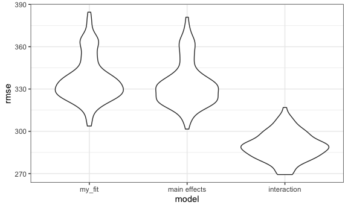
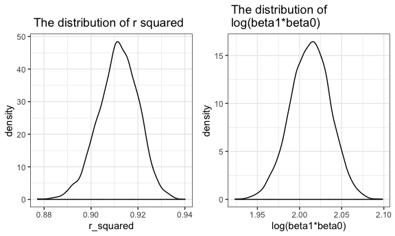

p8105\_hw6\_yl4358
================
YI LIU
11/21/2019

# Problem 1

``` r
birthweight_df = 
  read_csv("./data/birthweight.csv") %>% 
  janitor::clean_names() %>% 
  mutate(
    babysex = factor(babysex, levels = c(1, 2), labels = c("male", "female"), ordered = TRUE),
    frace = factor(frace, levels = c(1,2,3,4,8,9), labels = c("white", "black","asian","puerto_rican","other","unknown"), ordered = TRUE),
    malform = factor(malform, levels = c(0,1), labels = c("absent", "present"), ordered = TRUE),
    mrace = factor(mrace, levels = c(1,2,3,4,9), labels = c("white", "black","asian","puerto_rican","other"), ordered = TRUE)
  ) %>% 
  drop_na()
```

    ## Parsed with column specification:
    ## cols(
    ##   .default = col_double()
    ## )

    ## See spec(...) for full column specifications.

``` r
my_fit = lm(bwt ~ blength + delwt + smoken, data = birthweight_df)
summary(my_fit)
```

    ## 
    ## Call:
    ## lm(formula = bwt ~ blength + delwt + smoken, data = birthweight_df)
    ## 
    ## Residuals:
    ##     Min      1Q  Median      3Q     Max 
    ## -1716.5  -217.3    -3.9   211.7  4300.4 
    ## 
    ## Coefficients:
    ##               Estimate Std. Error t value Pr(>|t|)    
    ## (Intercept) -3963.0662    94.6286 -41.880  < 2e-16 ***
    ## blength       133.9318     1.9328  69.292  < 2e-16 ***
    ## delwt           2.9149     0.2368  12.310  < 2e-16 ***
    ## smoken         -2.4221     0.6925  -3.497 0.000474 ***
    ## ---
    ## Signif. codes:  0 '***' 0.001 '**' 0.01 '*' 0.05 '.' 0.1 ' ' 1
    ## 
    ## Residual standard error: 336.5 on 4338 degrees of freedom
    ## Multiple R-squared:  0.5685, Adjusted R-squared:  0.5682 
    ## F-statistic:  1905 on 3 and 4338 DF,  p-value: < 2.2e-16

I choose baby’s length at birth(`blength`), mother’s weight at
delivery(`delwt`) and average number of cigarettes(`smoken`) smoked per
day during pregnancy as predictor variables. Because baby’s birth weight
is highly related with the mother’s health status, I choose `delwt` and
`smoken` which represents mother’s health status during pregnancy.
According to common sense, the taller the baby is , the heavier the baby
is, thus I also choose `blength`. And accoding to their p-value, the
results are all significant. Therefore I build this model.

``` r
birthweight_df %>% 
  modelr::add_residuals(my_fit) %>% 
  modelr::add_predictions(my_fit) %>% 
  ggplot(aes(x = pred, y = resid)) + geom_point(alpha=.4 ) +
  stat_smooth(method = "lm")
```


According to the plot, the residuals of this model have an average about
0 and non constant variance. And there are some outliers.

``` r
fit1 = lm(bwt ~ blength + gaweeks, data = birthweight_df)

fit2 = lm(bwt ~ bhead * blength * babysex, data = birthweight_df)

cv_df = 
  crossv_mc(birthweight_df, 100) %>% 
  mutate(
    train = map(train, as_tibble),
    test = map(test, as_tibble)) %>% 
  mutate(my_fit  = map(train, ~lm(bwt ~ blength + delwt + smoken, data = .x)),
         fit1  = map(train, ~lm(bwt ~ blength + gaweeks, data = .x)),
         fit2  = map(train, ~lm(bwt ~ bhead * blength * babysex, data = .x))) %>% 
  mutate(rmse_my_fit = map2_dbl(my_fit, test, ~rmse(model = .x, data = .y)),
         rmse_fit1 = map2_dbl(fit1, test, ~rmse(model = .x, data = .y)),
         rmse_fit2 = map2_dbl(fit2, test, ~rmse(model = .x, data = .y)))


cv_df %>% 
  select(starts_with("rmse")) %>% 
  pivot_longer(
    everything(),
    names_to = "model", 
    values_to = "rmse",
    names_prefix = "rmse_") %>% 
  mutate(
    model = recode(model, "fit1" = "main effects", "fit2" = "interaction"),
    model = fct_inorder(model)
    ) %>% 
  ggplot(aes(x = model, y = rmse)) + geom_violin()
```


Accordint to the `rmse`, the model using head circumference, length,sex
and all interactions is the best, the model using length at birth and
gestational age is the next, and my fitting model is the worse.

# Problem 2

``` r
weather_df = 
  rnoaa::meteo_pull_monitors(
    c("USW00094728"),
    var = c("PRCP", "TMIN", "TMAX"), 
    date_min = "2017-01-01",
    date_max = "2017-12-31") %>%
  mutate(
    name = recode(id, USW00094728 = "CentralPark_NY"),
    tmin = tmin / 10,
    tmax = tmax / 10) %>%
  select(name, id, everything())
```

    ## Registered S3 method overwritten by 'crul':
    ##   method                 from
    ##   as.character.form_file httr

    ## Registered S3 method overwritten by 'hoardr':
    ##   method           from
    ##   print.cache_info httr

    ## file path:          /Users/yiliu/Library/Caches/rnoaa/ghcnd/USW00094728.dly

    ## file last updated:  2019-09-03 22:06:28

    ## file min/max dates: 1869-01-01 / 2019-09-30

``` r
clean_df = 
weather_df %>% 
  modelr::bootstrap(n = 5000) %>%
  mutate(
    models = map(strap, ~ lm(tmax ~ tmin, data = .x)),
    results1 = map(models, broom::tidy),
    results2 = map(models, broom::glance)) %>% 
  select(results1, results2) %>% 
  unnest(results2) %>% 
  select(results1,r.squared) %>% 
  unnest(results1) %>% 
  select(term, estimate, r.squared) %>% 
  pivot_wider(
    names_from = "term",
    values_from = "estimate"
  ) %>% 
  janitor::clean_names() %>% 
  mutate(
    log_beta12 = log(intercept*tmin)
  ) %>% 
  select(r_squared, log_beta12)

r_squared_plot = 
  clean_df %>% 
  ggplot(aes(x = r_squared)) +
  geom_density()+
  labs(
    title = " The distribution of r squared"
  )

log_beta12_plot = 
  clean_df %>% 
  ggplot(aes(x = log_beta12)) +
  geom_density()+
  labs(
    x = "log(beta1*beta0)",
    title = " The distribution of \n log(beta1*beta0)"
  )

r_squared_plot + log_beta12_plot
```



According to the distribution plots above, two quantities estimated are
almost normally distributed, and the average of estimated r squared and
log(beta1\*beta0\` is about 0.91 and 2.02 respectively.

``` r
quantile(clean_df$r_squared,c(0.025,0.975))
```

    ##      2.5%     97.5% 
    ## 0.8937751 0.9272885

``` r
quantile(clean_df$log_beta12,c(0.025,0.975))
```

    ##     2.5%    97.5% 
    ## 1.964858 2.058682

The 95% confidence interval for r squared is (0.8937751, 0.9272885).

The 95% confidence interval for log(beta1\*beta0) is (1.9648581,
2.0586824).
